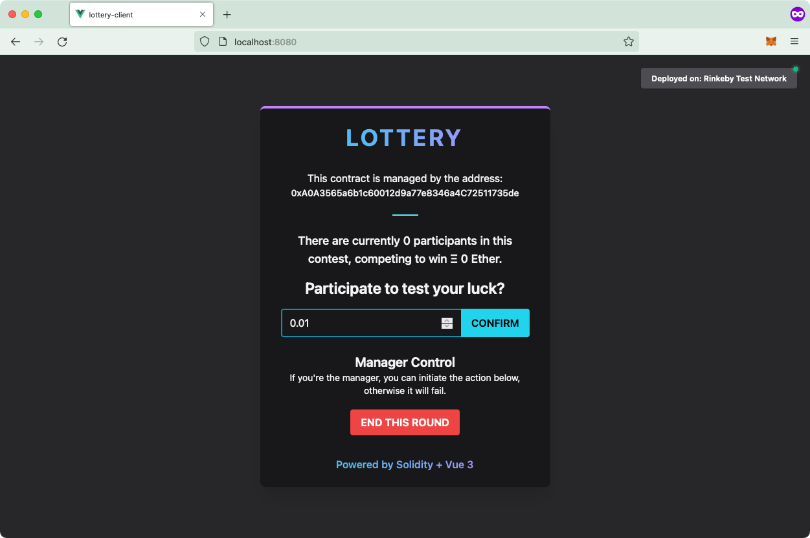

# Lottery

A project built with **Solidity** + **Vue 3**.

Each directory has its own corresponding **README** file, to get you started.
But if you just want to run the project, you may do so:

- `cd client`
- `npm i`
- `npm run dev`

This is my first **web3 project**. If you want to follow my journey, make sure to follow me on:

- [GitHub](https://github.com/dvlden/)
- [Twitter](https://twitter.com/dvlden)

Much appreciated :heart: !

> **NOTE:** I may or may not come back to my web3 projects in the future, to improve them with design and/or new features.
